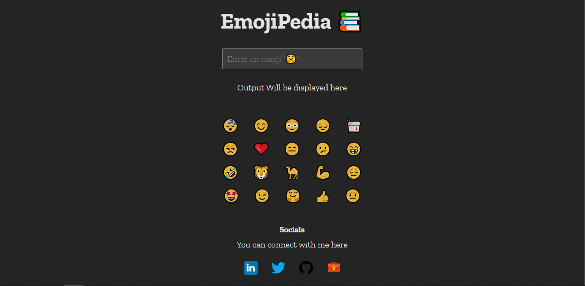

# # EmojiPedia 📚

#EmojiPedia 📚 is made using vanilla javascript. It explains the meaning of emojis that are used often but misinterpreted




## Getting Started

you can head over to the link below to see it in action. 🚀
[Check out app](https://emojipdia.netlify.app/)


## Built With

<p align="left"> <a href="https://www.w3schools.com/css/" target="_blank" rel="noreferrer">  </a> <a href="https://www.w3.org/html/" target="_blank" rel="noreferrer">  </a> <a href="https://developer.mozilla.org/en-US/docs/Web/JavaScript" target="_blank" rel="noreferrer">  </a> <a href="https://reactjs.org/" target="_blank" rel="noreferrer">  </a> </p>

## Installation

To clone and run this application, you'll need  [Git](https://git-scm.com/)  and  [Node.js](https://nodejs.org/en/download/)  (which comes with  [npm](http://npmjs.com/)) installed on your computer. From your command line:

```bash
# Clone this repository
$ git clone https://github.com/kumarhites/emojipedia.git

# Go into the repository
$ cd minion-translator

# Run the app
$ npm run dev 
```
